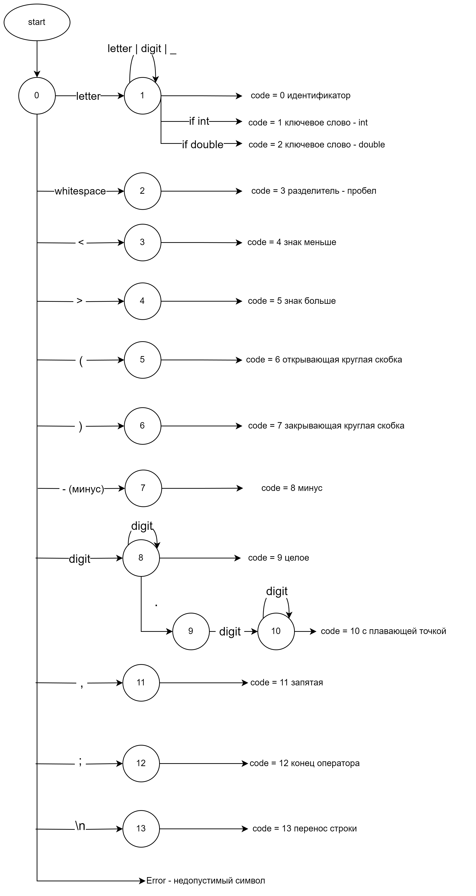
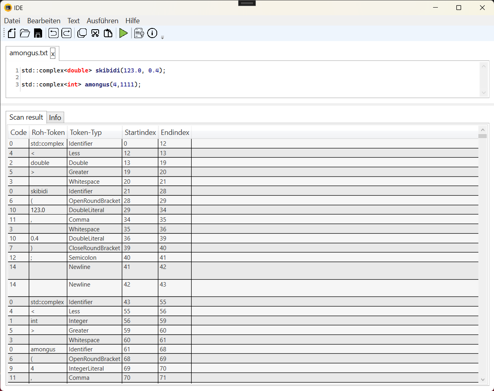
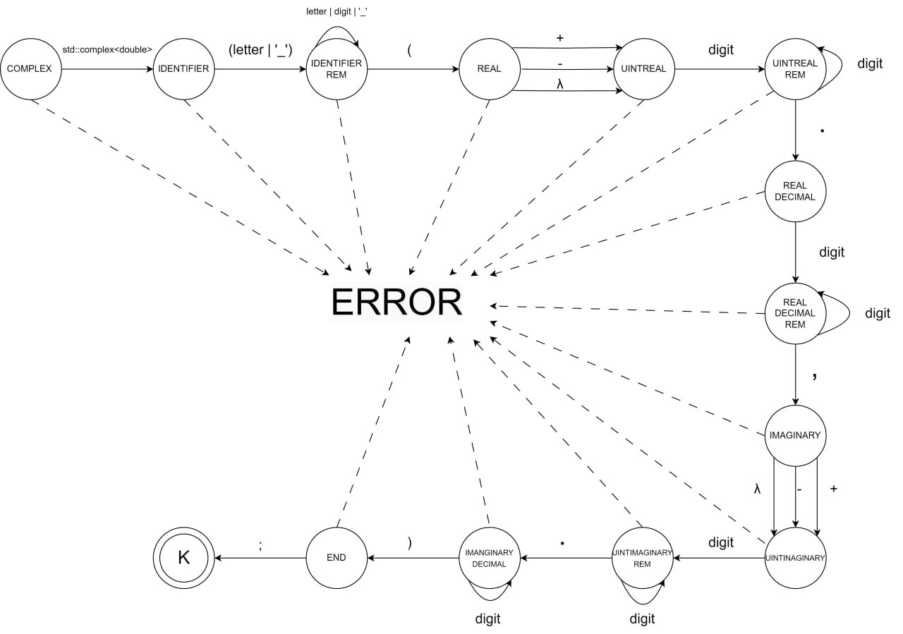
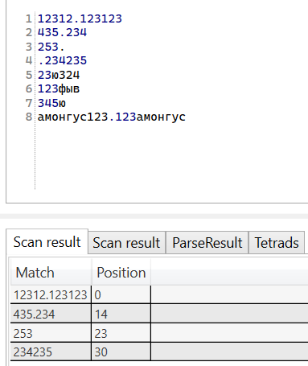
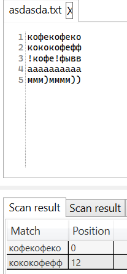
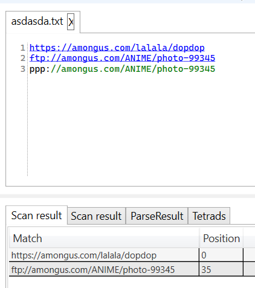

# Compiler
## Оглавление
[Лабораторная работа №1 по дисциплине Теория формальных языков и компиляторов. GUI](#лабораторная-работа-№1-по-дисциплине-теория-формальных-языков-и-компиляторов-gui)  
[Лабораторная работа №2. Разработка лексического анализатора.](#лабораторная-работа-№2-разработка-лексического-анализатора)  
[Лабораторная работа №3. Разработка парсера.](#лабораторная-работа-№3-разработка-парсера)  
[Лабораторная работа №5. Включение семантики в анализатор. Создание внутренней формы представления программы.](#лабораторная-работа-№5-включение-семантики-в-анализатор-создание-внутренней-формы-представления-программы)  
[Лабораторная работа №6. Регулярные выражения.](#лабораторная-работа-№6-разработка-парсера)  

## Лабораторная работа №1 по дисциплине Теория формальных языков и компиляторов. GUI

Создать


Открыть


Сохранить


Отмена


Копировать


Вырезать


Вставить


Пуск


Справка


О программе


Общний внешний вид программы


Пример локализации ru_RU


Пример локализации zn_CN


## Лабораторная работа №2. Разработка лексического анализатора.

Тема: Разработка лексического анализатора (сканера).
Цель работы: Изучить назначение лексического анализатора. Спроектировать алгоритм и выполнить программную реализацию сканера.

Вариант: Объявление комплексного числа с инициализацией на языке C++
Пример входной строки: std::complex<double> comp(10.0, 123.0);

В соответствии с вариантом задания необходимо:

1. Спроектировать диаграмму состояний сканера (примеры диаграмм представлены в прикрепленных файлах).
2. Разработать лексический анализатор, позволяющий выделить в тексте лексемы, иные символы считать недопустимыми (выводить ошибку).
3. Встроить сканер в ранее разработанный интерфейс текстового редактора. Учесть, что текст для разбора может состоять из множества строк.

Входные данные: строка (текст программного кода).
Выходные данные: последовательность условных кодов, описывающих структуру разбираемого текста с указанием места положения и типа.

```C++
    std::complex<double> comp(10.0,0.2);
```

### Диаграмме состояний сканера


### Примеры лексического анализа


## Лабораторная работа №3. Разработка парсера.
Цель работы: Изучить назначение синтаксического анализатора. Спроектировать алгоритм и выполнить программную реализацию парсера.

### Грамматика
G[COMPLEX = <комплексное число>]:   

VT = { ‘a’…’z’, ‘A’…’Z’, '=', 'std::complex<double>', '(', ')', '+', 'j', '-', '0'...'9', '.', ‘_’ }  

VN = { COMPLEX, IDENTIFIER, IDENTIFIERREM, REAL, UINTREAL, UINTREALREM, REALDECIMAL, REALDECIMALREM, IMAGINARY, UINTINAGINARY, UINTIMAGINARYREM, IMANGINARYDECIMAL,END, letter, digit }  

COMPLEX -> 'std::complex<double> 'IDENTIFIER  
IDENTIFIER -> (letter | '_')IDENTIFIERREM  
IDENTIFIERREM -> (letter | digit | '_')IDENTIFIERREM | '('REAL  
REAL -> ['+' | '-']UINTREAL  
UINTREAL -> digit UINTREALREM  
UINTREALREM -> digit UINTREALREM | '.' REALDECIMAL  
REALDECIMAL -> digit REALDECIMALREM  
REALDECIMALREM -> digit REALDECIMALREM | ',' IMAGINARY  
IMAGINARY -> ['+' | '-']UINTINAGINARY  
UINTINAGINARY -> digit UINTIMAGINARYREM  
UINTIMAGINARYREM -> digit UINTIMAGINARYREM | '.' IMANGINARYDECIMAL  
IMAGINARYDECIMAL -> digit IMAGINARYDECIMAL | ')' END  
END -> ';'  
digit -> '0' | '1' | '2' | ... | '9'  
letter -> 'a' | 'b' | ... | 'z' | 'A' | 'B' | ... | 'Z'   

### Граф конечного автомата


## Лабораторная работа №5. Включение семантики в анализатор. Создание внутренней формы представления программы.
Тема: включение семантики в анализатор. Создание внутренней формы представления программы. В качестве внутренней формы представления программы выберем тетрады. Тетрада имеет четыре поля: op, arg1, arg2 и result.

Цель работы: дополнить анализатор, разработанный в рамках лабораторных работ, этапом формирования внутренней формы представления программы.

Задание:

1. Дополнить парсер грамматикой G[<АВ>]. Реализовать данную КС-граммматику методом рекурсивного спуска:

```
    1. АВ →  id = T
    2. E → TA 
    3. A → ε | + TA | - TA 
    4. T → ОВ 
    5. В → ε | *ОВ | /ОВ 
    6. О → id | (E) 
```

2. Реализовать алгоритм записи выражений в форме тетрад. 

### Тестовые примеры
#### Пример №1. Без ошибок.


#### Пример №2. Ошибка.


## Лабораторная работа №6. Регулярные выражения.
Тема: реализация алгоритма поиска подстрок с помощью регулярных выражений.
Цель работы: реализовать алгоритм поиска в тексте подстрок, соответствующих заданным регулярным выражениям.

### I: Построить РВ, описывающее целые числа и числа с плавающей точкой (разделитель точка).
```re
"\b\d+(\.\d+)?\b"
```


### II: Построить РВ для проверки слов, содержащих подстроку “кофе” и имеющих ровно 10 символов.
```re
"\b(?=(?:.*кофе)+)(?=.{10}\b)\w+\b"
```


### III: Построить РВ, описывающее URL-ссылку на веб-страницу на латинице (с различными протоколами HTTP, HTTPS, FTP).
```re
"\b(http|https|ftp):\/\/[^\s/$.?#].[^\s]*\b"
```
