# Compiler
Лабораторная работа №1 по дисциплине Теория формальных языков и компиляторов. GUI

Создать

Открыть
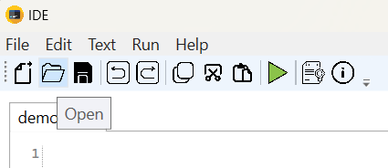

Сохранить
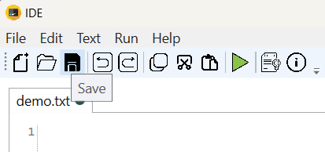

Отмена
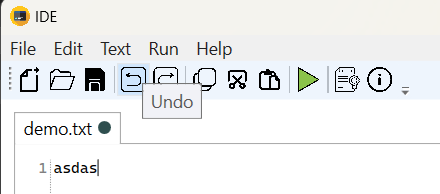

Копировать
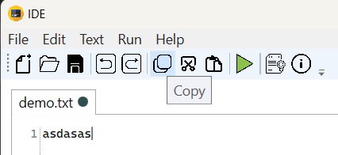

Вырезать
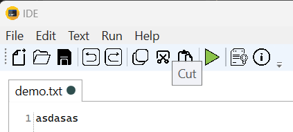

Вставить
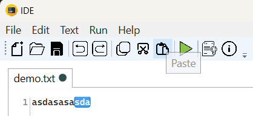

Пуск
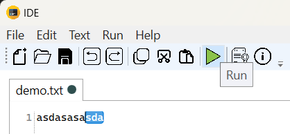

Справка
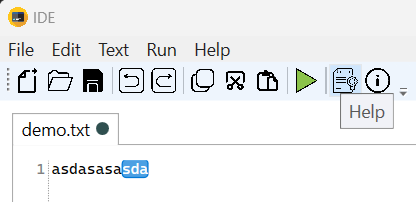

О программе
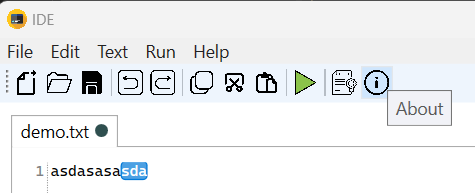

Общний внешний вид программы
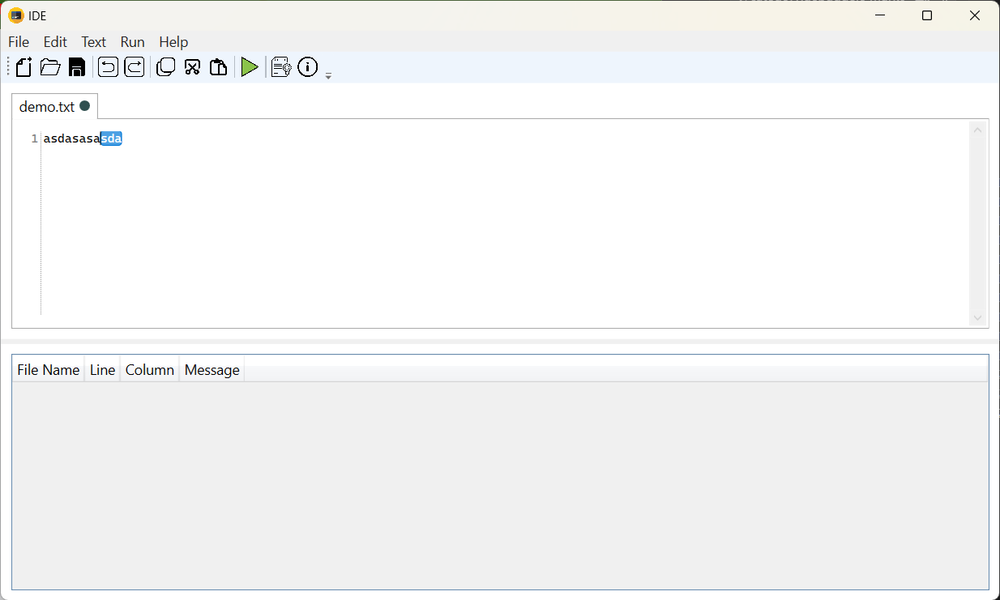

Пример локализации ru_RU
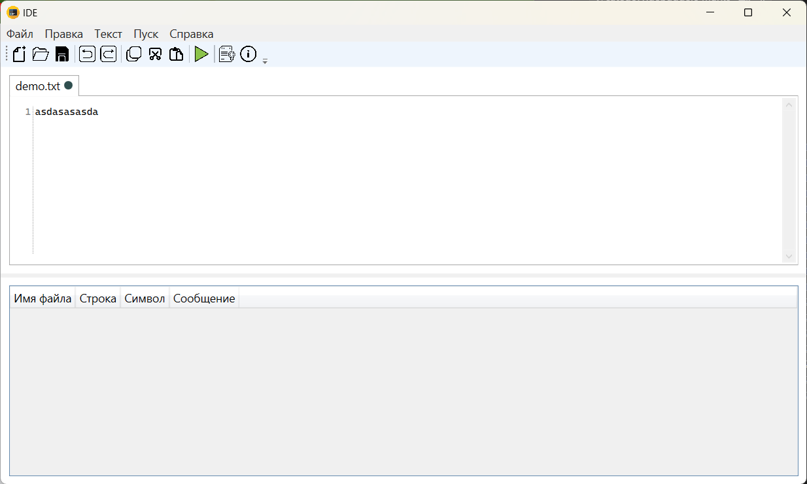

Пример локализации zn_CN
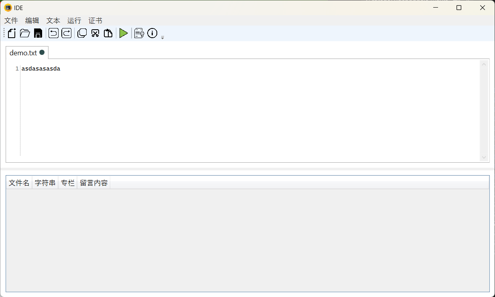