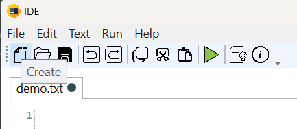

# Compiler
Лабораторная работа №1 по дисциплине Теория формальных языков и компиляторов. GUI

Создать

Открыть

Сохранить

Отмена

Копировать

Вырезать

Вставить

Пуск

Справка

О программе

Общний внешний вид программы

Пример локализации ru_RU

Пример локализации zn_CN
